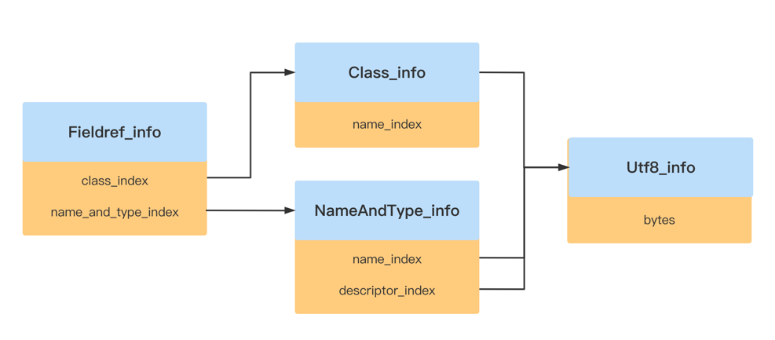
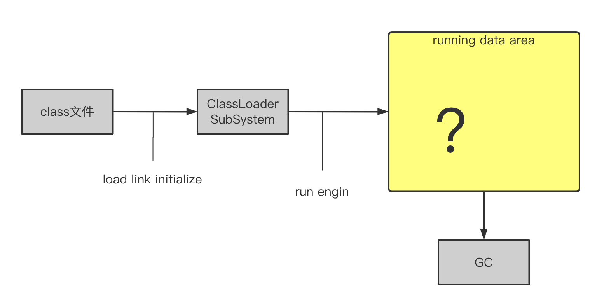
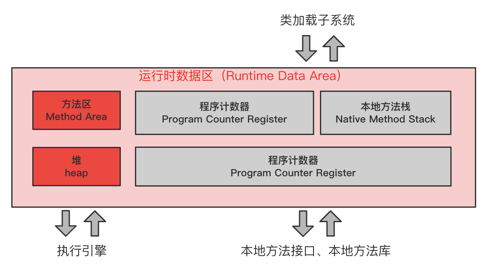
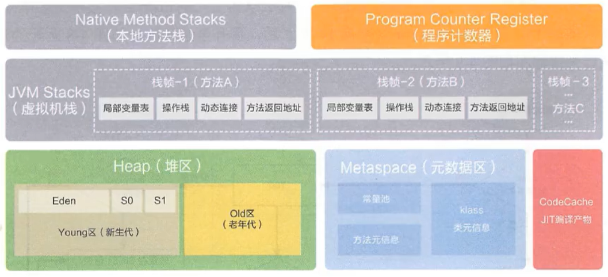
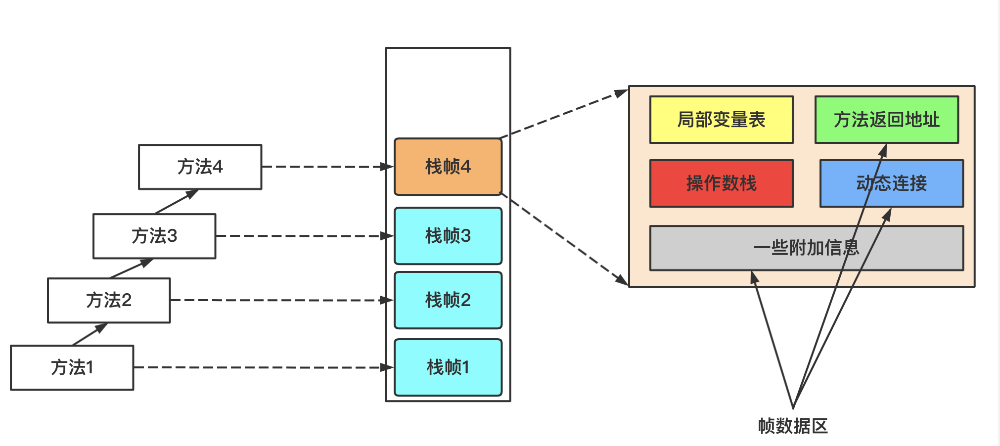

# Go-jvm
官方文档：https://docs.oracle.com/javase/specs/jvms/se8/html/index.html
## 命令行工具开发
进行测试：
```
# user是一个用户名
/Users/user/GolandProjects/Go-jvm/ch01/cmd -version
version 0.0.1

/Users/user/GolandProjects/Go-jvm/ch01/cmd -cp foo/bar/ MyApp arg1 arg2
classpath:foo/bar/ class:MyApp args:[arg1 arg2]

/Users/user/GolandProjects/Go-jvm/ch01/cmd -help
Usage: /Users/lidong.han/GolandProjects/Go-jvm/ch01/cmd [-options] class [args...]
```

## 搜索class文件
Java在写一个Hello World程序时，需要涉及到类加载，HotSpot VM是按照classpath去加载类的，加载顺序

（1）启动类路径（bootstrap classpath）（jre\lib\rt.jar）

（2）扩展类路径（extension classpath）(jre\lib\ext\)

（3）用户类路径（user classpath）(当前目录，可以通过classpath指定)

但是，这里我采用命令行指定类加载路径.

**实现类路径：**
类路径就是一个大的整体，它由启动类路径、扩展类路径和用户类路径三个小路径组成。三个小路径又分别由更小的路径构成。这就是组合模式（composite pattern）

这里是有4中Entry实体
* 第一种就是WildcardEntry: 用来解决用户需要找的class文件路径是一个模糊参数，/usr/load/java/src/*
* 第二种就是CompositeEntry: 用一个Entry切片 将是以".jar\.JAR"结尾的文件存放起来
* 第三种就是ZipEntry: 专门用来解析以".jar\.JAR\.zip\.ZIP"结尾的Entry
* 第四种就是DirEntry: 专门用来解析以路径+className.class的文件读取

可以说，前两种都是为了search class, 后两种都为了parse class.

### 测试
```
# 编译代码
go build    
# 执行程序, 没有输入jre的配置, 回去获取JAVA_HOME中配置的jre                                                    
/Users/user/GolandProjects/Go-jvm/ch02/ch02 java.lang.Object
# 执行程序   
/Users/user/GolandProjects/Go-jvm/ch02/ch02 -Xjre "jre的位置" java.lang.Object
```

## 解析class文件
### 1. class文件
  构成class文件的基本数据单位的字节，可以把整个class文件当成一个字节流来处理。 
  大一些的数据由连续多个字节构成，这些数据在class文件中以 [大端（big-endian ](https://baike.baidu.com/item/大小端模式/6750542) 方式存储。
为了描述class文件格式，Java虚拟机规范定义了u1、u2和u4三种数据类型来表示1、2和4字节无符号整数，分别对应Go语言的uint8、uint16和uint32类型。
相同类型的多条数据一般按照（table）的形式存储在class文件中。表由表头和表项（item）构成，表头是u2或u4整数。假设表头是n，后面就紧跟n哥表项数据。
```c
ClassFile {
    u4                   magic;
    u2                   minor_version;
    u2                   major_version;
    u2                   constant_pool_count;  // 常量池容量
    cp_info              constant_pool[constant_pool_count - 1];  // 常量池
    u2                   access_flags;
    u2                   this_class;
    u2                   super_class;
    u2                   interfaces_count;  // 接口数量
    u2                   interfaces[interfaces_count - 1];  // 接口
    u2                   fields_count;
    field_info           fields[fields_count];
    u2                   methods_count;  // 方法数量
    method_info          methods[methods_count];
    u2                   attributes_count;
    attribute_info       attributes[attributes_count];
}
```
JDK 提供了一个功能强大的命令行工具javap，可以将.java文件编译成.class文件。网上有人用JavaFX写了一个图形化界面的[classpy](https://github.com/zxh0/classpy) ，
可以使用classpy程序分析class文件格式。
### 2. 解析class文件
**Go和Java语言基本数据类型对照关系**

|    Go语言类型     | Java语言类型 |          说明          |
| :---------------: | :----------: | :--------------------: |
|       int8        |     byte     |    8比特有符号整数     |
| uint8（别名byte） |     N/A      |    8比特无符号整数     |
|       int16       |    short     |    16比特有符号整数    |
|      uint16       |     char     |    16比特无符号整数    |
| int32（别名rune） |     int      |    32比特有符号整数    |
|      uint32       |     N/A      |    32比特无符号整数    |
|       int64       |     long     |    64比特有符号整数    |
|      uint64       |     N/A      |    64比特无符号整数    |
|      float32      |    float     | 32比特 IEEE-754 浮点数 |
|      float64      |    double    | 64比特 IEEE-754 浮点数 |

#### 2.1 读取数据
根据上一章，我们已经可以找到class文件，并将其加载到内存中去，根据Java虚拟机规范规定了u1、u2和u3，
我们也需要用将数据转换成这种类似的类型，不过Go语言本身提供了很多数据类型，我们可以写一个**工具类**，
将内存中的[]byte字节流转换成我们需要的8位/16位/32位/64位/byte数组 和16位数组的形式。

#### 2.2 整体结构
[ClassFile Structure](https://docs.oracle.com/javase/specs/jvms/se8/html/jvms-4.html#jvms-4.1)

java虚拟机规范class文件的格式
```c
ClassFile {
    u4             magic;  // 魔术，value为0xCAFEBABE，class文件的标志
    u2             minor_version;  // jdk次版本号
    u2             major_version;  // jdk主版本号
    u2             constant_pool_count;  // 常量池大小
    cp_info        constant_pool[constant_pool_count-1];  // 常量池
    u2             access_flags;  // 类的访问限定标识符
    u2             this_class;  // 当前类
    u2             super_class;  // 父类
    u2             interfaces_count;  // 实现接口数量
    u2             interfaces[interfaces_count];  // 实现的接口
    u2             fields_count;  // 成员变量的数量
    field_info     fields[fields_count];  // 成员变量
    u2             methods_count;  // 方法的数量
    method_info    methods[methods_count];  // 方法
    u2             attributes_count;  // 属性数量
    attribute_info attributes[attributes_count];  // 属性（局部变量表、异常信息、符号信息...）
}
```
#### 2.3 魔术
就是为了标识某一种文件，比如PDF文件以4字节"%PDF"（0x25、0x50、0x44、0x46）开头，ZIP文件以2字节"PK"（0x50、0x4B）开头文件有自己的魔术，
py文件有自己的魔术，class文件的魔术是"0xCAFEBABE"开头。
#### 2.4 版本号
```shell
# 查看Java版本
java -version
# 显示结果
java version "1.8.0_321"
Java(TM) SE Runtime Environment (build 1.8.0_321-b07)
Java HotSpot(TM) 64-Bit Server VM (build 25.321-b07, mixed mode)
```
java分为主版本和次版本，1.8就是主版本，0_321就是次版本。class文件的也分为主版本 和 次版本，
一般版本可以表示为M.m，次版本号只在J2SE 1.2之前用过，从1.2开始基本上没用过了(都是0)。

JDK版本和class文件版本的对应关系

|  Java版本   | class文件版本 |
| :---------: | :-----------: |
|  JDK 1.0.2  |   45.0~45.3   |
|   JDK 1.1   | 45.0~45.65545 |
|  J2SE 1.2   |     46.0      |
|  J2SE 1.3   |     47.0      |
|  J2SE 1.4   |     48.0      |
| Java SE 5.0 |     49.0      |
|  Java SE 6  |     50.0      |
|  Java SE 7  |     51.0      |
|  Java SE 8  |     52.0      |

* 注：主需要记忆Java6的class版本是50.0
#### 2.5 类访问标识符
比如java.lang.String类，访问标识符值是0x31，它是由于public final修饰的类，而且调用类`invokespecial`指令，
这个指令的作用就是调用构造函数（除非没有构造函数可以不调用这个指令）。后面在**类和对象**会再次研究这个访问标识符。

| 标志名称         | 值      | 解释                                                     |
| ---------------- |--------| -------------------------------------------------------- |
| `ACC_PUBLIC`     | 0x0001 | 宣布`public`；可以从其包外部访问。                       |
| `ACC_FINAL`      | 0x0010 | 宣布`final`；不允许子类。                                |
| `ACC_SUPER`      | 0x0020 | 当被`invokespecial`指令 调用时，对超类方法进行特殊处理。 |
| `ACC_INTERFACE`  | 0x0200 | 是接口，不是类。                                         |
| `ACC_ABSTRACT`   | 0x0400 | 宣布`abstract`；不得实例化。                             |
| `ACC_SYNTHETIC`  | 0x1000 | 宣布合成；源代码中不存在。                               |
| `ACC_ANNOTATION` | 0x2000 | 声明为注解类型。                                         |
| `ACC_ENUM`       | 0x4000 | 声明为一种`enum`类型。                                   |

#### 2.6 字段和方法表
[字段](https://docs.oracle.com/javase/specs/jvms/se8/html/jvms-4.html#jvms-4.5) 和
[方法](https://docs.oracle.com/javase/specs/jvms/se8/html/jvms-4.html#jvms-4.6)
```c
field_info {
    u2             access_flags;  // 访问标识符
    u2             name_index;  // 名字索引
    u2             descriptor_index;  // 描述符索引
    u2             attributes_count;
    attribute_info attributes[attributes_count];  // 属性信息表
}
```
这里也就是一些访问限定符的描述，后面在介绍。

### 3. 解析常量池
[常量池](https://docs.oracle.com/javase/specs/jvms/se8/html/jvms-4.html#jvms-4.4) 占据类 class文件很大一部分数据，里面存放这各种各样的信息。（数字、字符串常量、接口名、字段和方法名等等）
#### 3.1 常量池结构体
常量池实际上也是一个表，但是有三点需要特别注意的
* 表头给出的常量池比实际大1。假设表头给出的值是n，那么常量池的实际大小是n-1。
* 有效的常量池索引是1 ～ n-1。0是无效索引，表示不指向任何常量。
* CONSTANT_Long_info 和 CONSTANT_Double_info 各占两个位置。也就是说，如果常量池中存在这两种常量，实际的常量数量比n-1 还要少，而且1 ～ n-1的某些数也会变成无效索引
 #### 3.2 ConstantInfo接口
[常量信息接口](https://docs.oracle.com/javase/specs/jvms/se8/html/jvms-4.html#jvms-4.4)
```c
cp_info {
    u1 tag;
    u1 info[];
}
```
java虚拟机规范一共定义了14种常量

Constant pool tag

| Constant Type                 | Value |
| ----------------------------- | ----- |
| `CONSTANT_Class`              | 7     |
| `CONSTANT_Fieldref`           | 9     |
| `CONSTANT_Methodref`          | 10    |
| `CONSTANT_InterfaceMethodref` | 11    |
| `CONSTANT_String`             | 8     |
| `CONSTANT_Integer`            | 3     |
| `CONSTANT_Float`              | 4     |
| `CONSTANT_Long`               | 5     |
| `CONSTANT_Double`             | 6     |
| `CONSTANT_NameAndType`        | 12    |
| `CONSTANT_Utf8`               | 1     |
| `CONSTANT_MethodHandle`       | 15    |
| `CONSTANT_MethodType`         | 16    |
| `CONSTANT_InvokeDynamic`      | 18    |

#### 3.3  CONSTANT_Integer_info、CONSTANT_Float_info、CONSTANT_Long_info、CONSTANT_Double_info
[Integer和Float](https://docs.oracle.com/javase/specs/jvms/se8/html/jvms-4.html#jvms-4.4.4) （像boolean\byte\short\char类型都比int小，都是存放在ONSTANT_Integer_info中）

[Long和Double](https://docs.oracle.com/javase/specs/jvms/se8/html/jvms-4.html#jvms-4.4.5)
#### 3.4 CONSTANT_Utf8_info
[utf8](https://docs.oracle.com/javase/specs/jvms/se8/html/jvms-4.html#jvms-4.4.7)
```c
CONSTANT_Utf8_info {
    u1 tag;
    u2 length;
    u1 bytes[length];
}
```
字符串在class 文件中是以MUTF-8（Modified UTF-8）方式编码的。MUTF-8编码方式和UTF-8编码方式大致相同，
但并不兼容。差别有两点：
* null字符串（代码点 U+0000）会被编码成2个字节：0xC0、0x80
* 补充字符串（Supplementary Characters，代码点大于U+FFFF的Unicode字符）是按UTF-16拆分为代理对（Surrogate Pair）分别编码的

解决方案：根据调查Java序列化机制也采用了MUTF-8编码。java.io.DataInput和java.io.DataOutput接口分别定义了readUTF()和writeUTF()方法，
可以读写MUTF-8编码的字符串。decodeMUTF8()函数就是根据java.io.DataInputStream.readUTF(DataInput)方法改写的。

#### 3.5 CONSTANT_String_info、CONSTANT_Class_info
[String字面量](https://docs.oracle.com/javase/specs/jvms/se8/html/jvms-4.html#jvms-4.4.3)
```c
CONSTANT_String_info {
    u1 tag;
    u2 string_index;
}
```

[class类或接口的符号引用](https://docs.oracle.com/javase/specs/jvms/se8/html/jvms-4.html#jvms-4.4.3)
#### 3.6 CONSTAN_NameAndType_info
字段或者方法的名称和描述符，CONSTANT_Class_info和[CONSTAN_NameAndType_info](https://docs.oracle.com/javase/specs/jvms/se8/html/jvms-4.html#jvms-4.4.6)
加在一起可以唯一确定一个字段或者描述符
```c
CONSTANT_NameAndType_info {
    u1 tag;
    u2 name_index;
    u2 descriptor_index;
}
```
字段或方法名由name_index给出，字段或方法的描述符由descriptor_index给出。name_index和descriptor_index都是常量池索引。
字段和方法名就是代码中出现的（或者编译器生成的）字段或方法的名字。Java虚拟机规范规定了一种简单的语法来描述字段和方法，规则如下：
1. 类型描述符 
 
     （1）基本类型byte、short、char、int、long、float和double的描述符是单个字母，分别对应B、S、C、I、J、F 和 D。注意，long的描述符是J 而不是 L

     （2）引用类型的描述符是 [+ 类的完全限定名+分号

     （3）数组类型的描述符是 字段类型的描述符
2. 字段描述符就是字段类型的描述符
3. 方法的描述符是（参数类型描述符）+返回值类型描述符，其中void返回值由单个字母V表示。

更加详细的可以参考Java虚拟机规范[字段](https://docs.oracle.com/javase/specs/jvms/se8/html/jvms-4.html#jvms-4.3.2)
[方法](https://docs.oracle.com/javase/specs/jvms/se8/html/jvms-4.html#jvms-4.3.3) 下面给出几个具体例子：

|     字段描述符      |     字段类型     |       方法描述符       |                 方法                 |
| :-----------------: | :--------------: | :--------------------: | :----------------------------------: |
|          S          |      short       |          ()V           |              void run()              |
| Ljava.lang.Object;  | java.lang.Object |  ()Ljava.lang.String;  |          String toString()           |
|         [I          |      Int[]       | ([Ljava.lang.String;)V |       void main(String[] args)       |
|         [[D         |    double[][]    |         (FF)I          |      int max(float X, float y)       |
| [Ljava.lang.String; | java.lang.String |         ([JJ)I         | int binarySearch(long[] a, long key) |

Java语言支持方法的重载（overload），不同的方法可以有相同的名字，只要参数列表不同即可。这就是CONSTANT_NameAndType_info结构要同时包含名称和描述符的原因。
因为名字相同，可以用描述符进行区分。那按照这样说，字段是不是也可以重名（重载），只要不同类型即可，从class文件看是可以的，
但是Java语法限制了不能这样做。

#### 3.7 CONSTANT_Fieldref_info、CONSTANT_Methodref_info、CONSTANT_Interfaceref_info
[CONSTANT_Fieldref_info](https://docs.oracle.com/javase/specs/jvms/se8/html/jvms-4.html#jvms-4.4.2) 表示字段符号引用，CONSTANT_Methodref_info表示普通方法（非接口）方法符号引用，
CONSTANT_Interfaceref_info表示接口方法符号引用，三个常量结构一样的。
```c
CONSTANT_Fieldref_info {
    u1 tag;
    u2 class_index;
    u2 name_and_type_index;
}

CONSTANT_Methodref_info {
    u1 tag;
    u2 class_index;
    u2 name_and_type_index;
}

CONSTANT_InterfaceMethodref_info {
    u1 tag;
    u2 class_index;
    u2 name_and_type_index;
}
```
相同的三个结构一样的可以采用继承的方式，但是Go语言没有继承，可以采用组合的方式（设计原则：多用组合，少用继承）
#### 3.8 CONSTANT_MethodType_info、CONSTANT_MethodHandle_info、CONSTANT_InvokeDynamic_info
[CONSTANT_MethodType_info](https://docs.oracle.com/javase/specs/jvms/se8/html/jvms-4.html#jvms-4.4.9) 、
[CONSTANT_MethodHandle_info](https://docs.oracle.com/javase/specs/jvms/se8/html/jvms-4.html#jvms-4.4.8) 、
[CONSTANT_InvokeDynamic_info](https://docs.oracle.com/javase/specs/jvms/se8/html/jvms-4.html#jvms-4.4.10)
这三个常量是Java SE 7才添加到class文件中的，目的是新增了 invokedynamic 指令（动态代理）。这里就不详细介绍了，有机会多了解一下动态代理，
Go语言是不支持动态代理的，本来还想开发一个Go语言的Spring框架，AOP只能通过动态代理实现，但是IOC功能还是可以做到。
#### 3.10 常量池小结
常量池可以分为两类：字面量（literal）和符号引用（symbolic reference）。字面量包含数字常量和字符串常量，
符号引用包括类和接口、字段和方法信息等。除了字面量，其他常量都是通过索引直接或者间接指向类CONSTANT_Utf8_info常量，
以CONSTANT_Fieldref_info为例，如下图：


### 4. 属性解析表
#### 4.1 AttributeInfo接口
属性[Attribute](https://docs.oracle.com/javase/specs/jvms/se8/html/jvms-4.html#jvms-4.7)
和常量类似，各种属性表达的信息也各不相同，因此无法用统一的结构定义。不同的是Java虚拟机规范严格定义常量一共14种。
但是属性可以根据不同实现的虚拟机进行扩展，自己定义自己的属性，HotSpot VM在Java8规定类23种属性。
```c
attribute_info {
    u2 attribute_name_index;
    u4 attribute_length;
    u1 info[attribute_length];
}
```
23种属性可以分为3类:
1. 五个属性对于虚拟机正确解释文件至关重要：
* ConstantValue
* Code
* StackMapTable
* Exceptions
* BootstrapMethods
2. 十二个属性对于Java类库对文件的正确解释至关重要：
* InnerClasses
* EnclosingMethod
* Synthetic
* Signature
* RuntimeVisibleAnnotations
* RuntimeInvisibleAnnotations
* RuntimeVisibleParameterAnnotations
* RuntimeInvisibleParameterAnnotations
* RuntimeVisibleTypeAnnotations
* RuntimeInvisibleTypeAnnotations
* AnnotationDefault
* MethodParameters
3. 六个属性对于 虚拟机 或 Java的类库对文件 正确解释并不重要 ，但对工具很有用：
* SourceFile
* SourceDebugExtension
* LineNumberTable
* LocalVariableTable
* LocalVariableTypeTable
* Deprecated

这里我们就暂时实现13个Code、ConstantValue、Exceptions、BootstrapMethods、InnerClasses、
EnclosingMethod、Synthetic、Signature、SourceFile、LineNumberTable、LocalVariableTable、
LocalVariableTypeTable、Deprecated。先解析了其中8个

#### 4.2 Deprecated和Synthetic属性
[Deprecated](https://docs.oracle.com/javase/specs/jvms/se8/html/jvms-4.html#jvms-4.7.15)
和 [Synthetic](https://docs.oracle.com/javase/specs/jvms/se8/html/jvms-4.html#jvms-4.7.8)
是两种最简单属性，仅起标志作用，不包含任何数据，所以 attribute_length 都必须为0。

Deprecated属性用于指出类、接口、字段和方法已经不建议使用，编译器可以根据Deprecated属性给出警告。
jdk5以前使用@deprecated标签指示编译器，jdk5开始使用@Deprecated注解。

Synthetic属性用来标记源文件中不存在、由编译器产生的类成员，引入Synthetic属性主要是为类支持嵌套类和嵌套接口。
（就是内部类和内部接口）
```c
Deprecated_attribute {
    u2 attribute_name_index;
    u4 attribute_length;
}

Synthetic_attribute {
    u2 attribute_name_index;
    u4 attribute_length;
}
```

#### 4.3 SourceFile和ConstantValue属性
[SourceFile](https://docs.oracle.com/javase/specs/jvms/se8/html/jvms-4.html#jvms-4.7.10)
和[ConstantValue](https://docs.oracle.com/javase/specs/jvms/se8/html/jvms-4.html#jvms-4.7.2)
属性，ConstantValue用于表示常量表达式的值，SourceFile用于指出源文件名。
```c
SourceFile_attribute {
    u2 attribute_name_index;
    u4 attribute_length;
    u2 sourcefile_index;
}

ConstantValue_attribute {
    u2 attribute_name_index;
    u4 attribute_length;
    u2 constantvalue_index;
}
```
字段类型和常量类型的对应关系

|            字段类型             |       常量类型        |
| :-----------------------------: | :-------------------: |
|              long               |  CONSTANT_Long_info   |
|              float              |  CONSTANT_Float_info  |
|             double              | CONSTANT_Double_info  |
| int、short、char、byte、boolean | CONSTANT_Integer_info |
|             String              | CONSTANT_String_info  |
#### 4.4 Code属性
[Code](https://docs.oracle.com/javase/specs/jvms/se8/html/jvms-4.html#jvms-4.7.3)
是变长属性，只存在method_info结构中。Code属性中存放字节码等方法相关信息。
```c
Code_attribute {
    u2 attribute_name_index;
    u4 attribute_length;
    u2 max_stack;          // 操作数栈最大深度
    u2 max_locals;         // 局部变量表大小
    u4 code_length;        // 字节码数量
    u1 code[code_length];  // 字节码
    u2 exception_table_length;
    {   u2 start_pc;    // 当前操作数栈位置
        u2 end_pc;      // 操作数栈等偏移量  [start_pc, start_pc + end_pc]
        u2 handler_pc;  // 异常处理等开始，操作字节码等索引
        u2 catch_type;  // catch住的异常类型
    } exception_table[exception_table_length];  // 方法异常表
    u2 attributes_count;    // 属性数量
    attribute_info attributes[attributes_count];
}
```
后面在了解到类指令集和解释器时，才会去操作字节码
#### 4.5 Exceptions属性
[Exceptions](https://docs.oracle.com/javase/specs/jvms/se8/html/jvms-4.html#jvms-4.7.5)
属性，记录方法抛出的异常表
```c
Exceptions_attribute {
    u2 attribute_name_index;
    u4 attribute_length;
    u2 number_of_exceptions;                         // 异常数量
    u2 exception_index_table[number_of_exceptions];  // 异常表
}
```
#### 4.6 LineNumberTable和LocalVariableTable属性
[LineNumberTable](https://docs.oracle.com/javase/specs/jvms/se8/html/jvms-4.html#jvms-4.7.12)
和[LocalVariableTable](https://docs.oracle.com/javase/specs/jvms/se8/html/jvms-4.html#jvms-4.7.13)
属性，LineNumberTable属性表存放方法的行号信息，LocalVariableTable属性表存放方法的局部变量表信息，
这两个属性和前面的SourceFile都是属于调试信息，使用javac编译程序，默认会在class文件生成这些信息。
```c
LineNumberTable_attribute {
    u2 attribute_name_index;
    u4 attribute_length;
    u2 line_number_table_length;
    {   u2 start_pc;
        u2 line_number;	
    } line_number_table[line_number_table_length];
}

LocalVariableTable_attribute {
    u2 attribute_name_index;
    u4 attribute_length;
    u2 local_variable_table_length;
    {   u2 start_pc;
        u2 length;
        u2 name_index;
        u2 descriptor_index;
        u2 index;
    } local_variable_table[local_variable_table_length];
}
```

#### 4.7 BootstrapMethods、InnerClasses、EnclosingMethod、Signature和LocalVariableTypeTable属性

* BootstrapMethods属性表示invokedynamic指令的引导方法说明
* InnerClasses属性表示内部类属性，可变长度属性, 
如果类或接口的常量池包含至少一个CONSTANT_Class_info, 它表示不是包成员的类或接口, 
则表示表中必须恰好有一个InnerClasses属性
* EnclosingMethod属性表示固定长度，当前仅当 类表示本地类或者匿名类, 类必须要有封闭方法属性, 
类最大只能有一个 封闭方法属性
* Signature属性表示 记录类、接口、构造函数、方法或字段的签名

   （1）签名: 就是对Java编写代码的一种声明式编码, 比如B C D F I J S Z就是对一些基本类型的签名, 还有一些参数类型,包等等
   
   （2）详细的签名类型请查看官方文档
* LocalVariableTypeTable属性表示可变长属性, 因为一个虚拟机栈有多个方法/栈桢

### 测试
```shell
# 编译程序
go build
# 执行程序   
/Users/user/GolandProjects/Go-jvm/ch03/ch03 java.lang.String
# 生成的结果
java.lang.String
version: 52.0
constants count: 550
access flags: 0x31
this class: java/lang/String
super class: java/lang/Object
interfaces: [java/io/Serializable java/lang/Comparable java/lang/CharSequence]
fields count: 5
  value
  hash
  serialVersionUID
  serialPersistentFields
  CASE_INSENSITIVE_ORDER
methods count: 94
   <init>
   <init>
   <init>
   <init>
   <init>
   ...
   # (省略类一些方法)
```

## 运行时数据区
### 1. 运行时数据区

内存是非常重要的系统资源，是硬盘和CPU的中间仓库及桥梁，承载着操作系统和应用程序的实时运行。
JVM内存布局规定了Java在运行过程种内存申请、分配、管理的策略，保证了JVM的高效稳定运行。
不同的JVM对于内存的划分方式和管理机制存在着分布差异。结合JVM虚拟机规范，来学习一下经典的JVM内存布局。（HotSpot）

**多线程共享的内存区域**主要存放两类数据：类数据和类实例（对象）。对象数据存放在堆(heap)中，
类数据存放在方法区(Method Area)/元空间(Metaspace)中。堆由垃圾收集器清理，所以我们不需要关注
堆空间的内存释放。类数据包括字段和方法信息、方法的字节码、运行时常量池等等。从逻辑上来讲，
方法区也是堆区的一部分，Java虚拟机规范也并没有规定必须要方法区，JRockit、IBM J9都是不存在方法区的。

**线程私有的运行时数据区**用来辅助执行Java字节码。每个线程都有自己的pc寄存器（Program Counter）
和Java虚拟机栈（JVM Stack）、本地方法栈（就是JVM Stack，两者是二合一的）。Java虚拟机栈由栈桢
（Stack Frame）构成。栈桢由局部变量表（Local Variable）、操作数栈（Operand Stack）、
方法返回地址（Return Address）、动态链接（Dynamic Linking）和一些附加信息（可能不存在），
在任何时候，某个线程都需要来执行自己虚拟机栈上的方法，这个帧叫做当前帧， 这个方法就是当前Java方法， 
则pc寄存器存放当前正在执行的Java虚拟机指令地址，否则当前方法是本地方法，pc寄存器中的值没有明确意义。
整个JVM的全外貌，在使用Go语言实现jvm时，不需要考虑堆和垃圾收集器。Go语言本身的垃圾收集器可以帮你去处理垃圾对象进行内存的回收。


### 2. 数据类型
Java虚拟机可以操作两类数据：基本类型（primitive type）和引用类型（reference type）。
基本类型就是数据本身，引用类型的变量存放的是对象引用，真正的对象数据是在堆里分配的，
这里讲的变量是类变量（静态字段）、实例变量（非静态变量）、数组元素、方法的参数和局部变量等等。

基本类型可以进一步分为布尔类型（boolean type）和数字类型（numeric type），
数组类型又可以分为整数类型（integral type）和浮点类型（floating-point type）。引用类型可以进一步分为3种：
类类型、接口类型和数组类型。类类型引用指向类实例，数组类型引用指向数组实例，接口类型引用指向实现了该接口的类或数组实例。
引用类型又一个特殊值——null，表示该类型不可以指向任何对象。

Go语言提供类非常丰富的数据类型，包括各种整数和两种精度的浮点数。Java和Go的浮点数都是采用IEEE754规范。


### 2. 数据类型
Java虚拟机可以操作两类数据：基本类型（primitive type）和引用类型（reference type）。
基本类型就是数据本身，引用类型的变量存放的是对象引用，真正的对象数据是在堆里分配的，
这里讲的变量是类变量（静态字段）、实例变量（非静态变量）、数组元素、方法的参数和局部变量等等。

基本类型可以进一步分为布尔类型（boolean type）和数字类型（numeric type），
数组类型又可以分为整数类型（integral type）和浮点类型（floating-point type）。引用类型可以进一步分为3种：
类类型、接口类型和数组类型。类类型引用指向类实例，数组类型引用指向数组实例，接口类型引用指向实现了该接口的类或数组实例。
引用类型又一个特殊值——null，表示该类型不可以指向任何对象。

Go语言提供类非常丰富的数据类型，包括各种整数和两种精度的浮点数。Java和Go的浮点数都是采用IEEE754规范。

### 3. 实现运行时数据区
#### 3.1 线程
线程私有的就是 PC程序计数器和虚拟机栈/本地方法栈。

注意：虚拟机栈和本地方法栈逻辑上是分开的两个栈，实际上可以用一个栈实现。-Xss可以设置虚拟机栈的大小（TODO后面实现）。
#### 3.2 虚拟机栈、栈帧、局部变量表、操作数栈

这个它们的关系就是上图，虚拟机栈是线程私有的，虚拟机栈里面存放的是栈帧（方法），
栈帧里面有局部变量表、操作数栈、动态链接、方法返回地址、一些附加信息。
* 局部变量表：就是存放一些方法需要的局部变量，存放在slot（槽位），非静态方法slot的0号位置是this
* 操作数栈：存放当前需要执行的一些字节码指令，可以做一些简单的运算、交换、复制等操作。
* 动态链接：变量和方法的引用(符号引用)保存中class文件中的常量池（运行时常量池）中，
为了将这些符号引用转换为调用方法的直接引用
* 方法返回地址：存放调用该方法的pc寄存器的值。 一个方法的结束，有两种方式:
（1）正常执行完成(pc寄存器) （2）出现未处理的异常，非正常退出(通过异常表确定，不保存中栈帧中)
### 测试
```shell
# 编译程序
go build
# 执行程序   
/Users/user/GolandProjects/Go-jvm/ch04/ch04 test
# 生成的结果
100
-100
2997924580
-2997924580
+3.141593e+000
+2.718282e+000
0x0
0x0
+2.718282e+000
+3.141593e+000
-2997924580
2997924580
-100
100
```

## 指令集和解释器
### 字节码和指令集
字节码中存放编码后的Java虚拟机指令。每条指令都以一个单字节的操作码（opcode）开头，这就是字节码名称的由来。
由于只是用一字节表示操作码，那么Java虚拟机做多只能支持256(2^8)条指令。 到jdk1.8为止，
Java虚拟机规范已经定义了205条指令，操作码分别是0（0x00）到202（0xCA）、254（0xFE）和255（0xFF）。
这205条指令构成了Java虚拟机的指令集（instruction set）。和汇编语言类似，为了便于记忆，Java虚拟机规范给每个操作码都制定了一个助记符（mnemonic）。
比如操作码是0x00这条指令，因为它什么也不做，所以它的助记符就是nop（no operation）。

Java虚拟机使用的是变长指令，操作码后面可以根零字节或多字节的操作数（operand）。
如果把指令想象成函数的话，操作数就是它的参数。为了让编码后的字节码更加紧凑，很多操作码本身就隐含了操作数，
比如常数0推如操作数栈的指令iconst_0。

在第4节中规定过，操作数栈和局部变量表只存放数据的值，并不记录数据类型（当然也是可以做的，可以给方法加一个check字段，把数据类型枚举）。
结果就是：指令必须知道自己栈操作什么类型的数据。这一点也直接反映栈了操作码的助记符上。
比如iadd指令就是对int值进行加法操作；dstore指令把操作数栈顶的double值弹出，存储到局部变量表中；
areturn指令从方法中返回引用值。也就是说，如果某类指令可以操作不同类型的变量，则助记符的第一个字母表示变量类型。
助记符首字母和变量对应关系如下表

| 助记符首字母 |   数据类型   |          case          |
| :----------: | :----------: | :--------------------: |
|      a       |  reference   | aload、astore、areturn |
|      b       | byte/boolean |     bipush、baload     |
|      s       |    short     |    sipush、sastore     |
|      i       |     int      |   iload、store、iadd   |
|      l       |     long     |  lload、lstore、ladd   |
|      f       |    float     |  fload、fstore、fadd   |
|      d       |    double    |  dload、dstore、dadd   |
|      c       |     char     |    caload、castore     |

Java虚拟机规范把已经定义的205条指令按用途分成了11类，分别是：常量（constants）指令、加载（loads）指令、
存储（stores）指令、操作数栈（stack）指令、数学（math）指令、转换（conversions）指令、比较（comparisons）指令、
控制（control）指令、引用（references）指令、扩展（extended）指令和保留（reserved）指令

保留指令一共3条。其中一条是留给调试器的，用于实现断点，操作码是202（0xCA），助记符是breakpoint。
另外两条留给Java虚拟机实现内部使用，操作码分别是254（0xFE）和266（0xFF），助记符是impdep1和impdep2。
这三条指令不允许出现在class文件中。
### 总结
Go语言实现其实屏蔽了很多运行时数据区，其实屏蔽了很多的困难，堆这个比较繁琐的内存管理就不需要实现。

```java
/**
 * 高斯考试:
 * 计算1+2+...+100 = ?
 * result: 5050
 */
public class GaussTest {
    public static void main(String[] args) {
        int sum = 0;
        for (int i = 1; i <= 100; i++) {
            sum += i;
        }
        System.out.println(sum);
    }
}
```


```shell
# 编译程序
go build
# 执行程序   
/Users/user/GolandProjects/Go-jvm/ch05/ch05 GaussTest
# 生成的结果
PC:  0 instruction: *constants.ICONST_0 &{{}}
PC:  1 instruction: *stores.ISTORE_1 &{{}}
PC:  2 instruction: *constants.ICONST_1 &{{}}
PC:  3 instruction: *stores.ISTORE_2 &{{}}
PC:  4 instruction: *loads.ILOAD_2 &{{}}
PC:  5 instruction: *constants.BIPUSH &{100}
PC:  7 instruction: *comparisons.If_ICMPGT &{{13}}
PC: 10 instruction: *loads.ILOAD_1 &{{}}
PC: 11 instruction: *loads.ILOAD_2 &{{}}
PC: 12 instruction: *math.IADD &{{}}
PC: 13 instruction: *stores.ISTORE_1 &{{}}
PC: 14 instruction: *math.IINC &{2 -13}
LocalVars: [{0 <nil>} {1 <nil>} {-12 <nil>}]
OPerandStack: &{0 [{1 <nil>} {1 <nil>}]}
panic: Unsupported opcode: 0xb2! [recovered]
        panic: Unsupported opcode: 0xb2!

goroutine 1 [running]:
main.catchErr(0xc000070400)
...
// 后面的报错不用处理, 因为没有实现return指令
```
## go语言总结
defer+recover()机制:
相当于Java中的try-catch机制, 程序下面执行出现异常, 本来需要panic直接终止,
但是可以在这个函数的开始加上defer-recover住这个异常, 使得程序不会panic继续向下运行

go语言返回值:
go语言规定了返回值(cf *ClassFile, err error), 可以return不写。
但是没有规定返回值名称(*ClassFile, error), return必须写（return cf, nil）


